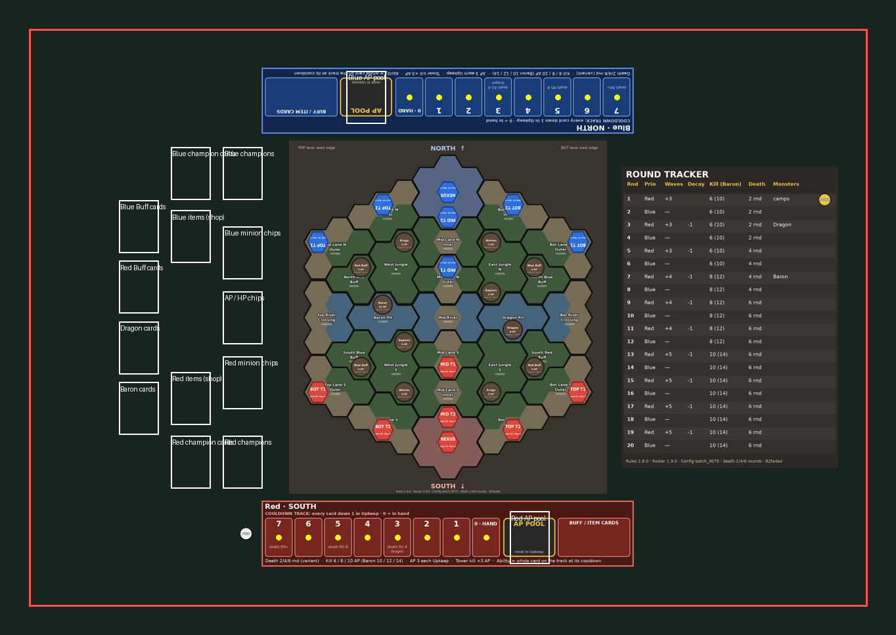

# Hex-Nexus: Tabletop Simulator mod

A Tabletop Simulator (TTS) table for playtesting Hex-Nexus with people. Every
number, hex, champion and item on the table is **generated from this
repository**. After a rules, roster or config change, run one command to
rebuild the mod.

| Milestone | State |
|---|---|
| **M0 static mod** | **Built.** Board, tiles, all components and cards are generated from the repo; the game is played by hand with the rulebook. Verified headless (see *Testing*). Not yet opened in real TTS. |
| M1 bookkeeping | next |
| M2 action assist + parity harness | later |
| M3 telemetry | later |
| M4 bridge (stretch) | later |

Current build: **Rules 1.9.0 · Roster 1.9.0 · Config `batch_0075`**. That is
the settled v1.9 rules with **2 / 4 / 6 death timers**, the designer's choice
for playtests. Rulebook-vs-engine differences are listed in
[`RULES_DISCREPANCIES.md`](RULES_DISCREPANCIES.md). The one-page quick start
for testers is [`PLAYTEST_GUIDE.md`](PLAYTEST_GUIDE.md).



## Build

```bash
pip install pillow
python tools/tts_export.py --rules 1.9.0 --roster 1.9.0 --config reports/requests/batch_0075.json
python tools/tts_preview.py          # optional: tts/build/preview.png, a top-down check
```

The build writes to `tts/build/`:

| File | What |
|---|---|
| `HexNexus_<rules>_<roster>.json` | The TTS save: every object, the Global script and each object's script inlined, plus the panel UI. |
| `data.lua` | Every number the mod uses, as Lua tables: map, roster, items, config, per-round schedule and layout. It is inlined at the top of the Global script. |
| `assets/` | 138 PNGs: 27 hexgroup tiles × 2 sides, the mat, 2 dashboards, the round tracker, the card sheets, standees, structures, monsters, chips and markers. |

Options:

- `--config`: any sim request with `config_overrides`. For example,
  `batch_0074.json` builds the 3 / 4 / 5 death timers. The config is
  `engine/config.py` `DEFAULT_CONFIG` with the overrides applied, exactly as
  the simulator does it.
- `--asset-base URL`: where TTS fetches the images from (see *Hosting*).

The build stamps the rules, roster and config versions and the git commit on
the mat, the tracker, the item cards and the panel. A commit ending in
`-dirty` means the build was made with uncommitted source changes.

### What reads what

| Source | Used for |
|---|---|
| `rules/Hex-Nexus_Rules_v<rules>.md` | version label (the file must exist) |
| `rules/map_v1.json` | tiles, terrain, structures, lane paths, spawn hexes, monster hexes |
| `roster/roster_v<roster>.json` via `engine.kits.load_roster` | champion cards, standees, HP counters (L0 added as the engine does) |
| `engine/config.py` + request overrides via `engine.config.make_config` | structure HP and floors, decay schedule, wave sizes, kill AP, death positions, monster HP and spawns, AP base, Dragon and Baron card text |
| `engine/items.py` | item and buff cards |
| `engine/resolve.py` `DEATH_BANDS` | the round bands of the death track |

## Load in TTS

1. Copy `tts/build/HexNexus_1.9.0_1.9.0.json` into your TTS saves folder:
   - Windows: `Documents\My Games\Tabletop Simulator\Saves\`
   - macOS: `~/Library/Tabletop Simulator/Saves/`
   - Linux: `~/.local/share/Tabletop Simulator/Saves/`
2. In TTS: **Create → Singleplayer / Multiplayer → Games → Save & Load**, and
   pick *Hex-Nexus 1.9.0 / 1.9.0 (batch_0075)*.
3. **First load:** once the images have downloaded, the Global script lays out
   the table. It sizes every generated object to its drawn size and puts it on
   its hex. The chat shows *"Hex-Nexus: laid out N objects."*
   - If the board art looks **rotated 180°** (NORTH printed at the bottom from
     the South seat, or coordinates upside down), press **Art 180°** on the
     panel. TTS's default image orientation could not be checked from here, so
     this switch is built in.
   - **Re-layout** (host or promoted players only) puts every generated object
     back in its starting place.
4. Save the game in TTS once it looks right. The layout is stored and does not
   run again.

## Hosting the images

TTS loads images from URLs.

- **Default: raw GitHub.** The build points at
  `https://raw.githubusercontent.com/Noitues/Games/<branch>/tts/build/assets/`.
  The repo is public, so this works as soon as the build is pushed.
  - If the branch is deleted or renamed, the URLs break. Rebuild with
    `--asset-base` pointing at the new branch or a commit SHA.
  - TTS caches images by URL. After a rebuild that changes images, clear
    **Menu → Configuration → Mod Caching**, or rebuild against a commit SHA:
    commit the assets first, then run
    `--asset-base https://raw.githubusercontent.com/Noitues/Games/<sha>/tts/build/assets`.
- **Steam Cloud, for a stable public mod:** load the save with any working URLs.
  Open **Modding → Cloud Manager → Upload all loaded files**, then save. TTS
  rewrites every URL in the save to your Steam Cloud copy.
- **Local, while iterating:**
  `--asset-base file:///C:/path/to/Games/tts/build/assets`. Only works on your
  own machine.

## Play

See [`PLAYTEST_GUIDE.md`](PLAYTEST_GUIDE.md). In M0 the rules are played by
hand with the rulebook. The table does the following for you:

- **Panel (top right, "HN" hides it):**
  - rules, roster and config versions and the commit
  - round, phase and who has priority
  - this round's numbers: wave spawn and size, decay, kill reward, death-track position, monster spawns
  - a reminder for the current phase
  - a live count of the chips in each team's AP pool
  - **Next phase / Next round** move the round and priority markers.
- **Hexgroup tiles:** right-click → *Flip hexgroup* swaps the hidden side
  (outline only) for the visible side (every hex, with coordinates) and back.
- **HP counters** on champions, towers, the Nexus and monsters: left-click −1,
  right-click +1. Towers and the Nexus show their decay floor. Monsters that
  have not spawned yet show *down*.
- **Chips:** three infinite bags (Blue minions, Red minions, neutral AP/HP).
  Every chip is 1 HP and 1 AP.
- **Dashboards:** a cooldown track per team (positions 7 … 0), the AP pool
  area, and a row for buff and item cards. The Dragon position (3) and the
  death positions (3 / 5 / 7) are printed on their slots.

## Collecting logs

Arrives with M3: an event log, JSONL game records sent to
`tools/tts_collect.py`, and a feedback card.

## Testing

```bash
apt-get install lua5.2          # once
python tts/tests/smoke_m0.py
```

The test rebuilds the mod and runs its scripts in plain Lua 5.2 against a fake
TTS API (`tts/tests/tts_stub.lua`). It checks:

- every script compiles and loads;
- calibration fits every generated object to its intended size, whatever base
  size the fake TTS gives a custom image, and centres the art on its bounds;
- each round's wave spawn and size, decay, kill AP and death-track position
  match the **Python engine**. The engine's own `kill_champion`, `kill_reward`,
  `wave_size` and `decay_structures` run on a real game state for every round,
  so this is not the exporter checking itself;
- AP pool counting, hexgroup flips, HP counters, and save/load of the table
  state.

Currently **435 checks, 0 failed**. A mutation check confirms the test can
fail: building with 3 / 4 / 5 timers against the 2 / 4 / 6 engine expectation
produces 31 failures.

The Lua referee parity harness (`tts/tests/run.lua`) is part of M2.

### Not verified yet: needs a real TTS session

- The image orientation. **Art 180°** is the fallback.
- The size TTS gives custom tokens and tiles. Calibration measures and
  corrects it, but it has only run against the fake API.
- The table choice (`Table_RPG`) and whether the layout (about 58 × 50 units)
  fits it.
- Whether stacked chips are counted correctly in the pool zones. The count
  uses `getQuantity()` on stacks.

## Files

```
tools/tts_export.py     the exporter (sources → data.lua, images, save)
tools/tts_art.py        Pillow renderers (no game numbers of its own)
tools/tts_preview.py    top-down PNG of the table from the save + images
tts/lua/global.lua      Global script: calibration, panel, pool count, flips
tts/lua/counter.lua     HP counter for champions, structures and monsters
tts/lua/tile.lua        hexgroup tile: "Flip hexgroup" context menu
tts/lua/ui.xml          the panel
tts/tests/              headless smoke test and the fake TTS API
tts/build/              generated: save, data.lua, assets, preview
```
